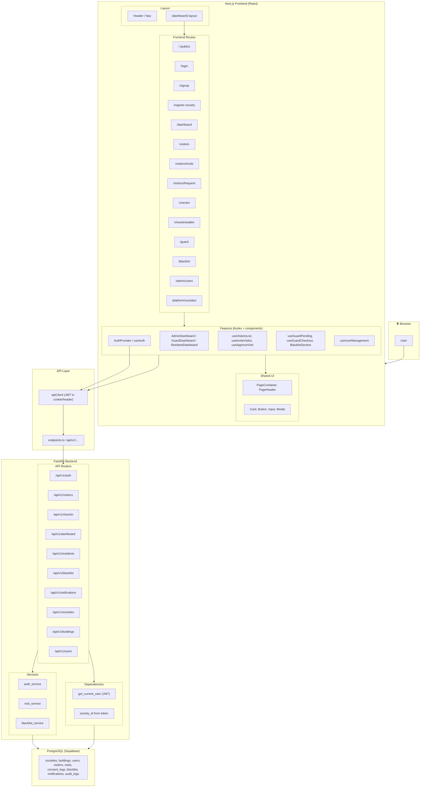
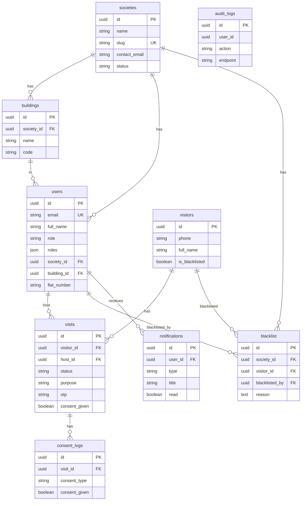

# Visitor Management System — Architecture & How It Works

One place for **system architecture**, **component tree**, **data flow**, **route map**, and **database ER**. Below: a single high-level diagram, then the **database ER** in a second diagram.

---

## 1. System, Routes, Components & Data Flow (One Diagram)

**How it works (short):**

- **Browser** → user opens **Next.js** app; **AuthProvider** holds user and token.
- **Frontend routes** (e.g. `/dashboard`, `/visitors`, `/guard`) render **feature** components that call **apiClient** with JWT.
- **apiClient** hits **FastAPI** at `/api/v1/...`; **routers** use **dependencies** (e.g. `get_current_user`, society from token) and **services** to talk to **PostgreSQL**.
- **Data flow:** Login/Signup → JWT stored → every API request sends JWT → backend resolves user & society → services read/write DB.

---

## 2. Database ER Diagram

**Relations in short:**

- **Society** has many **Building**s and many **User**s (residents, guards, committee).
- **User** has many **Visit**s as host; **Visitor** has many **Visit**s; each **Visit** can have **ConsentLog**s (DPDP).
- **Blacklist** links **Society**, **Visitor**, and **User** (who blacklisted).
- **Notification** belongs to **User**.
- **AuditLog** stores user_id, action, endpoint (no FK for flexibility).

---

## 3. Route ↔ API Mapping (Quick Reference)

| Frontend route        | Main API used |
|-----------------------|----------------|
| `/login`, `/signup`   | `POST /auth/login`, `POST /auth/signup` |
| `/register-society`   | `POST /auth/register-society` |
| `/dashboard`         | `GET /dashboard/stats`, `my-requests`, `muster` |
| `/visitors`           | `GET /visitors`, `PATCH /visitors/:id/approve` |
| `/visitors/invite`    | `POST /visitors/invite`, `GET /buildings` |
| `/visitors/frequent`  | `GET /visitors` (derived) |
| `/checkin`            | `POST /checkin/otp`, `POST /checkin/qr` |
| `/checkin/walkin`     | `POST /visitors/walkin`, `GET /residents` |
| `/guard`              | Dashboard + visitors + `POST /checkin/checkout`, blacklist APIs |
| `/blacklist`          | `GET/POST /blacklist`, `POST /blacklist/by-phone`, `DELETE /blacklist/:id` |
| `/admin/users`        | `GET/POST/PATCH /users` |
| `/platform/societies` | `GET/POST /societies` |

This file gives you **one diagram for how the system, components, data flow, and routes work**, plus **one ER diagram** and a **route–API map** in a single place.
