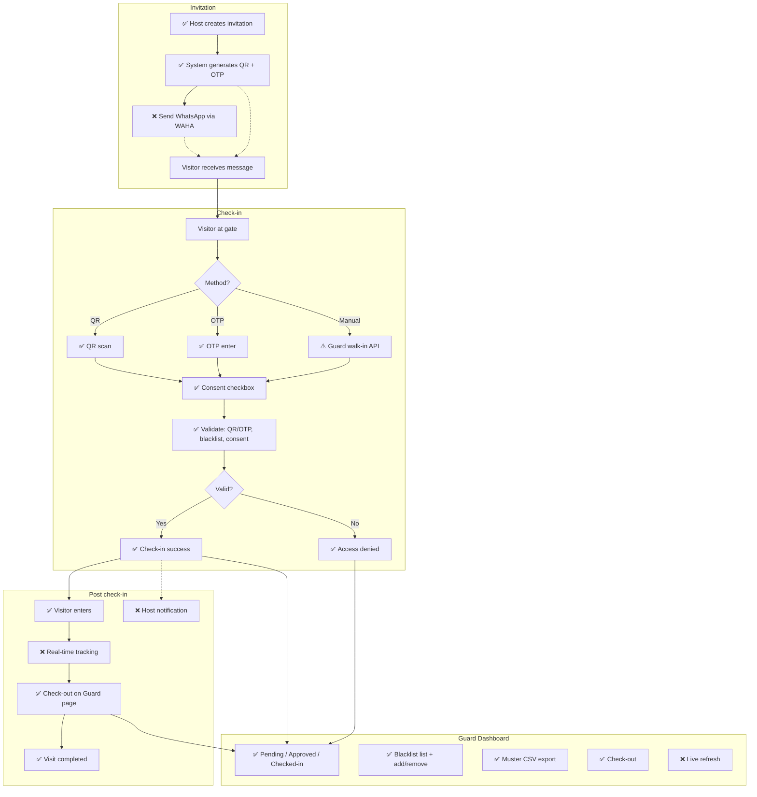

# VMS Flow Diagram – Implementation Status

One diagram: **✅ Done** | **❌ TODO** | **⚠️ Partial**

---

## Status Legend

| Status | Meaning |
|--------|---------|
| ✅ Done | Implemented and working |
| ❌ TODO | Not implemented |
| ⚠️ Partial | API/backend exists; UI or integration incomplete |

---

## Implemented (This Round)

| # | Item | Notes |
|---|------|-------|
| 1 | **WhatsApp (WAHA)** | Set WAHA_API_URL; sends invite after create |
| 2 | **Host notification** | In-app notification when visitor checks in |
| 3 | **Guard live refresh** | Polling every 30s on Guard page |
| 4 | **Time validity** | ±60 min of expected_arrival; optional on invite |
| 5 | **QR expiry** | Same as OTP (30 min) |
| 6 | **Expected arrival** | Optional field on invite form |

## Remaining to Implement

| # | Item | Notes |
|---|------|-------|
| 1 | **Super Admin** | Buildings, flats, guards, config |
| 2 | **Resident registration** | Flats, family, badges (currently demo user) |
| 3 | **Real-time tracking** | Live status during visit (beyond guard poll) |
