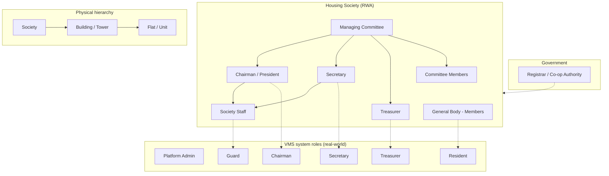

# Indian Residential Society Hierarchy & Role-Based Access

Based on **Maharashtra Co-operative Societies Act, 1960**, Model Bye-laws, RWA norms, and typical gated-community structure across India.

---

## 1. Legal & management hierarchy

```
                    ┌─────────────────────────────────────────┐
                    │   REGISTRAR / STATE CO-OP AUTHORITY      │
                    │   (Government oversight, registration)    │
                    └─────────────────────┬───────────────────┘
                                          │
                    ┌─────────────────────▼───────────────────┐
                    │   FEDERATION (optional, city/area level) │
                    │   e.g. Federation of Co-op Housing      │
                    └─────────────────────┬───────────────────┘
                                          │
    ┌─────────────────────────────────────▼─────────────────────────────────────┐
    │                     HOUSING SOCIETY (RWA / Co-op Society)                  │
    │   • Registered legal entity (MCS Act / Societies Registration Act)          │
    │   • One society = one gated community / campus                             │
    └─────────────────────┬───────────────────────────────────┬─────────────────┘
                          │                                   │
          ┌────────────────▼────────────────┐    ┌─────────────▼─────────────┐
          │   GENERAL BODY (all members)    │    │   MANAGING COMMITTEE      │
          │   • All flat-owner members      │    │   (elected, 5-year term)   │
          │   • Annual meetings, elections  │    │   Typically 11–19 members  │
          └────────────────────────────────┘    └─────────────┬─────────────┘
                                                                │
                    ┌───────────────────────────────────────────┼───────────────────────────────────────┐
                    │                       │                   │                                       │
          ┌─────────▼─────────┐    ┌──────────▼──────────┐   ┌────▼────┐    ┌────────────────────────────▼────┐
          │ CHAIRMAN/        │    │ SECRETARY           │   │TREASURER │    │ COMMITTEE MEMBERS                 │
          │ PRESIDENT        │    │ • Records, meetings │   │ • Funds  │    │ • Expert/Functional Directors   │
          │ • Chief executive│    │ • Service staff     │   │ • Audit  │    │ • Elected members                │
          │ • Final authority│    │ • Day-to-day admin  │   │          │    │                                  │
          └─────────┬────────┘    └──────────┬──────────┘   └────┬────┘    └──────────────────────────────────┘
                    │                        │                   │
                    └────────────────────────┼───────────────────┘
                                             │
                    ┌────────────────────────▼────────────────────────┐
                    │              SOCIETY STAFF (operational)        │
                    │  • Security / guards    • Maintenance / housekeeping │
                    │  • Gate staff          • Office staff (if any)   │
                    └────────────────────────────────────────────────┘
```

---

## 2. Physical / location hierarchy

Used for **address, visitor routing, and “where does the resident live?”** in the VMS:

```
    SOCIETY (one campus, one RWA)
         │
         ├── BUILDING / TOWER 1   (e.g. "Tower A", "Block 1")
         │        ├── Wing 1 (optional)
         │        │     ├── Floor 1 → Flats 101, 102, …
         │        │     ├── Floor 2 → Flats 201, 202, …
         │        │     └── …
         │        └── …
         │
         ├── BUILDING / TOWER 2
         │        └── …
         │
         └── BUILDING / TOWER N
                  └── …
```

**Typical terms used in India**

| Level        | Common names                          | Example        |
|-------------|----------------------------------------|----------------|
| Society     | Society, RWA, Complex, Layout           | "Green Valley CHS" |
| Building    | Tower, Block, Building, Wing (sometimes) | "Tower A", "B Block" |
| Sub-building| Wing, Lobby (optional)                 | "Wing 1", "North" |
| Unit        | Flat, Unit, House number               | "1201", "B-402" |

In the VMS, **Society → Building → Flat** is the minimum; **Wing** can be added if needed.

---

## 2.1 Three society types (registration options) – how architecture differs

The app offers **three main society types** in registration (plus "Other"). Their **legal basis** and **physical structure** differ; the VMS should reflect that where it affects hierarchy and labels.

| Type | Value in app | Legal basis | Typical physical structure | Registration |
|------|----------------|-------------|-----------------------------|--------------|
| **Cooperative Housing Society (CHS)** | `cooperative_housing` | State Co-operative Societies Act (e.g. MCS Act 1960). Society owns land + building; members have shares/occupancy. | **Society → Tower/Block → Flat.** Multi-tower apartment complex. | Registrar of Co-op Societies. **Registration number is standard** (e.g. MH/HSG/xxxx). |
| **Apartment Owners Association (AOA)** | `aoa` | State Apartment Ownership Act (e.g. MAO Act 1970). Flat owners hold sale deeds; AOA manages common areas. | **Society (AOA) → Building/Tower → Flat.** Same as CHS physically; different ownership. | May be registered; format varies by state. |
| **Residents Welfare Association (RWA)** | `rwa` | Societies Registration Act, 1860. Voluntary; welfare focus; **limited legal authority**. | **Society (RWA) → Block/Sector/Phase → Plot or House.** Can be colony/layout with **plots or independent houses**, not only towers with flats. | District Registrar (societies). Often no tower–flat structure. |

### Hierarchy by type (what to model)

```
CHS / AOA (apartment complex):
  Society → Building (Tower A, Block B) → Flat / Unit (1201, B-402)

RWA (colony / layout with plots or houses):
  Society → Building (Block, Sector, Phase) → Unit = Plot no. / House no. (P-12, H-5)
```

So for **RWA**, the same data model (Society → Building → “flat_number”) works if we treat:
- **Building** = Block / Sector / Phase
- **flat_number** = Plot number or House number

The **labels** in the UI should change by type (e.g. “Tower/Block” vs “Block/Sector”, “Flat number” vs “Plot/House number”).

### What the app currently has vs what’s missing

| Aspect | CHS | AOA | RWA | In app today |
|--------|-----|-----|-----|----------------|
| Society → Building → Unit | ✓ Same | ✓ Same | ✓ Same (Building = block/sector, Unit = plot/house) | ✓ One model for all |
| Registration number | Usually mandatory | Optional / varies | Optional | Optional for all |
| Registration year | Common | Sometimes | Sometimes | ✓ Optional field |
| **Unit label** (Flat vs Plot vs House) | Flat / Unit | Flat / Unit | Plot / House | **Missing** – always “Flat” |
| **Building label** (Tower vs Block vs Sector) | Tower, Block | Tower, Block | Block, Sector, Phase | **Missing** – always “Building” |
| Validation by type | Registration no. often required | — | — | **Missing** – no type-based validation |
| Help text / placeholders by type | e.g. “Registrar registration no.” | e.g. “AOA registration if any” | e.g. “Plot/House number” | **Missing** |

**Recommendations**

1. **Add type-based labels in the UI** (registration and dashboard):
   - **CHS / AOA:** “Building (Tower/Block)”, “Flat number”.
   - **RWA:** “Block / Sector”, “Plot or House number”.
2. **Optional:** Store `unit_label` and `building_label` on Society (or derive from `society_type`) and use in forms and lists.
3. **Optional:** For CHS, recommend or require registration number in validation/UI (e.g. “Recommended for Cooperative Housing” or required when type = CHS).
4. **Keep one physical hierarchy** (Society → Building → unit on User); only labels and validation differ by `society_type`.

---

## 3. Role hierarchy for VMS (RBAC)

Roles in the app use **real-world position names**: Chairman, Secretary, Treasurer, Resident, Guard (and optional Platform Admin).

```
                    ┌──────────────────────────────────────┐
                    │  PLATFORM ADMIN (platform_admin)      │  ← Optional: multi-society / SaaS
                    │  • Manages multiple societies         │
                    │  • Platform settings, support         │
                    └────────────────────┬─────────────────┘
                                         │
    ┌────────────────────────────────────▼────────────────────────────────────┐
    │  COMMITTEE (chairman, secretary, treasurer)                               │
    │  • Real-world positions; same permissions as society admin                │
    │  • One society; full control within it                                   │
    │  • Users, buildings, blacklist, settings, reports                        │
    └────────────────────┬───────────────────────────────────┬─────────────────┘
                         │                                   │
           ┌─────────────▼─────────────┐         ┌─────────────▼─────────────┐
           │  GUARD (guard)            │         │  RESIDENT (resident)       │
           │  • Gate / security staff  │         │  • Flat owner / member     │
           │  • Check-in, walk-in,     │         │  • Invite visitors,        │
           │    blacklist, muster      │         │    view own visits         │
           └──────────────────────────┘         └──────────────────────────┘
```

---

## 4. Role–responsibility matrix (for VMS)

| Role            | Society scope     | Visitor invite | Check-in / walk-in | Blacklist | Users / buildings | Reports / muster |
|-----------------|-------------------|----------------|---------------------|-----------|-------------------|------------------|
| **Platform admin** | All societies   | —              | —                    | —         | Yes (all)         | Yes              |
| **Chairman / Secretary / Treasurer** | One society | Yes            | Yes                  | Yes       | Yes (own society) | Yes              |
| **Guard**          | One society     | No             | Yes                  | Yes       | No                | View/export      |
| **Resident**       | Own flat only   | Yes (own)      | No                   | No        | No                | Own visits       |

---

## 5. Hierarchy graph (Mermaid) – management + VMS roles



---

## 6. Real-world position → VMS role mapping

| Real-world position              | VMS role             | Notes                                      |
|----------------------------------|----------------------|--------------------------------------------|
| Chairman, President              | **chairman**         | Full society control in VMS                |
| Secretary                        | **secretary**        | Day-to-day admin, same permissions         |
| Treasurer                        | **treasurer**        | Committee; same permissions if they manage staff/visitors |
| Committee member                 | **chairman** / **secretary** / **treasurer** or **resident** | Assign by responsibility |
| Security guard / gate staff      | **guard**            | Check-in, walk-in, blacklist, muster        |
| Flat owner / family member       | **resident**         | Invite visitors, see own visits             |
| Tenant (if allowed by society)   | **resident**         | Same as resident if society permits        |

---

## 7. References (conceptual basis)

- **Maharashtra Co-operative Societies Act, 1960** – registration, management committee, bye-laws.
- **Model Bye-laws** (e.g. under MCS Act) – committee strength, Chairman/Secretary/Treasurer roles.
- **RWA (Resident Welfare Association)** – Societies Registration Act, 1860; member representation.
- **Crest Force / SmartKhata** – security guard duties and visitor management at gate.
- **NoBroker Hood / Magicbricks** – committee roles and society structure.

---

## 8. How to use this in the VMS

1. **Societies** – One record per housing society (RWA/co-op).
2. **Buildings** – One per tower/block; linked to society.
3. **Users** – Linked to society + building + flat; **role** = one of: `chairman` | `secretary` | `treasurer` | `guard` | `resident` (and `platform_admin` for multi-society).
4. **Visitor flow** – Resident invites → Guard checks in at gate; blacklist and muster at society level.
5. **RBAC** – Committee roles (chairman, secretary, treasurer) have society-admin permissions; guard and resident as in the matrix above.

This gives you a single hierarchy document and role model aligned with Indian society structure and government framework, which you can use to define and enforce role-based access in the app.
